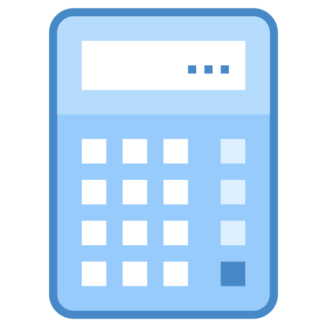

 

  

  <h3 align="center">Calculator Constructor</h3>

  

    Calculator that can be constructed from different components, such as a display, numeric keypad, operations, and equal sign.
     
    <a href="https://calc-constructor.vercel.app/">View Demo</a>
  

## About The Project

[![Calculator constructor][constructor-screenshot]](https://example.com)

The Calculator Constructor is an application that allows you to perform mathematical calculations and create a customized calculator by assembling different components. With this app, you can choose from various elements, such as a display, numeric keypad, operations, and equal sign, and combine them to create a calculator.

You can drag and drop the elements to rearrange them as you like. Once you're satisfied with your calculator design, you can use it.

### Calculator Components

- `Display`: This is the area where the calculator shows the numbers, results, and other information.
- `Numeric keypad`: This is the set of buttons that contain the numbers and decimal point (⚠️ in our case - comma).
- `Operations`: This is the set of buttons that contain the operations.
- `Equal sign`: This button shows the result of a calculation.

## Usage

The Calculator Constructor App has two different modes:

- `Active mode`: This is the mode, where you can perform basic mathematical operations such as addition, subtraction, multiplication, and division.

- `Constructor mode`: This is the default mode of the calculator, where you can create a custom calculator by selecting and arranging different components. In constructor mode, you can choose from various elements and combine them to create a calculator. To delete a component, double-click on it.

To switch between the active mode and the constructor mode, click on the "Runtime" or "Constructor" button located at the top of the screen. Your current calculation or calculator design will be saved automatically when you switch between modes.

## Contact

Oleg Shcherbakov - Telegram: [@uidpb](https://t.me/uidpb), Email: oshcherbakov2018@mail.ru

(<a href="#readme-top">back to top</a>)

[constructor-screenshot]: public/constructor.jpg
